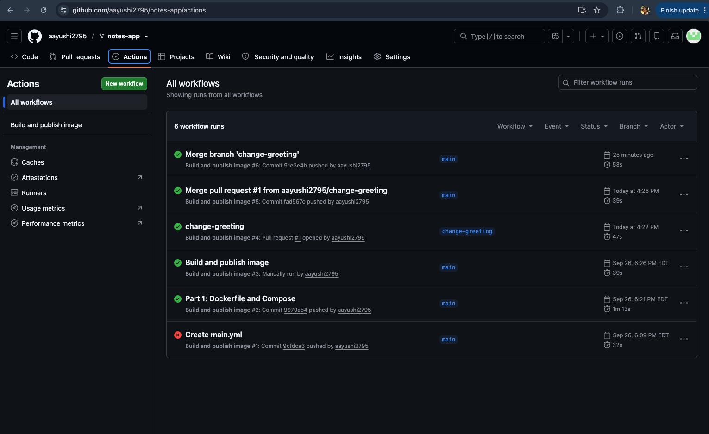
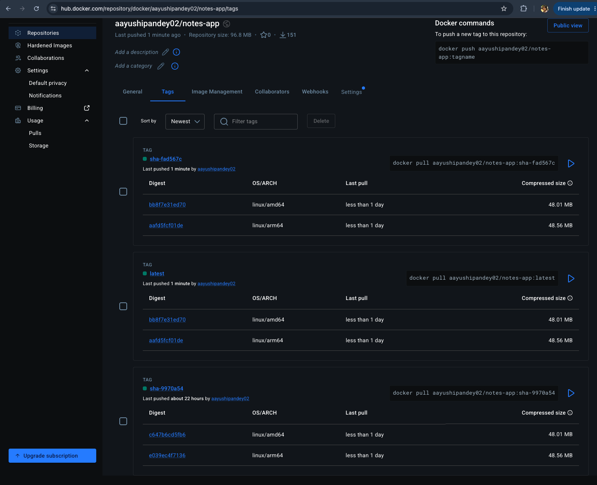

Output of kubectl get all.pvc

(base) aayu@Aayushis-MacBook-Air notes-app % kubectl get all,pvc
NAME                       READY   STATUS    RESTARTS   AGE
pod/db-6c5c8947cd-thfz7    1/1     Running   0          67m
pod/web-67784479d9-7cgbx   1/1     Running   0          31m
pod/web-67784479d9-dj96z   1/1     Running   0          31m

NAME          TYPE        CLUSTER-IP     EXTERNAL-IP   PORT(S)    AGE
service/db    ClusterIP   10.96.214.37   <none>        5432/TCP   78m
service/web   ClusterIP   10.96.71.178   <none>        80/TCP     76m

NAME                  READY   UP-TO-DATE   AVAILABLE   AGE
deployment.apps/db    1/1     1            1           78m
deployment.apps/web   2/2     2            2           76m

NAME                             DESIRED   CURRENT   READY   AGE
replicaset.apps/db-6c5c8947cd    1         1         1       78m
replicaset.apps/web-667d58db4f   0         0         0       76m
replicaset.apps/web-67784479d9   2         2         2       31m

NAME                            STATUS   VOLUME                                     CAPACITY   ACCESS MODES   STORAGECLASS   VOLUMEATTRIBUTESCLASS   AGE
persistentvolumeclaim/db-data   Bound    pvc-01392550-f4de-465f-9d6b-944915548055   1Gi        RWO            standard       <unset>                 78m

Experiment 2 output

(base) aayu@Aayushis-MacBook-Air notes-app % curl http://localhost:8000/
curl -X POST http://localhost:8000/notes \
  -H "Content-Type: application/json" \
  -d '{"body": "hello from kubernetes"}'
curl http://localhost:8000/notes
{"message":"Namaste from the notes app!","served_by":"web-667d58db4f-nxb5x","service":"notes-app"}
{"body":"hello from kubernetes","id":1}
[{"body":"hello from kubernetes","created_at":"2026-09-27T20:48:23.399345+00:00","id":1}]
(base) aayu@Aayushis-MacBook-Air notes-app % curl -X POST http://localhost:8000/notes -H "Content-Type: application/json" \
  -d '{"body": "I should survive a pod deletion"}'
kubectl delete pod -l app=db
kubectl get pods -w          # wait for the new db pod to be 1/1 Running
curl http://localhost:8000/notes
{"body":"I should survive a pod deletion","id":2}
pod "db-6c5c8947cd-8gg88" deleted

Experiment 3 output 

(base) aayu@Aayushis-MacBook-Air notes-app % kubectl scale deployment web --replicas=4
kubectl rollout status deployment/web
kubectl run curl --rm -it --restart=Never --image=curlimages/curl -- \
  sh -c 'for i in 1 2 3 4 5 6 7 8; do curl -s http://web/; echo; done'
deployment.apps/web scaled
Waiting for deployment "web" rollout to finish: 2 out of 4 new replicas have been updated...
Waiting for deployment "web" rollout to finish: 2 of 4 updated replicas are available...
Waiting for deployment "web" rollout to finish: 3 of 4 updated replicas are available...
deployment "web" successfully rolled out
{"message":"Namaste from the notes app!","served_by":"web-667d58db4f-5lxvk","service":"notes-app"}

{"message":"Namaste from the notes app!","served_by":"web-667d58db4f-5lxvk","service":"notes-app"}

All commands and output from this session will be recorded in container logs, including credentials and sensitive information passed through the command prompt.
If you don't see a command prompt, try pressing enter.
Session ended, resume using 'kubectl attach curl -c curl -n notes-lab -i -t' command
pod "curl" deleted from notes-lab namespace

Output of kubect1 rollout history deployment/web

(base) aayu@Aayushis-MacBook-Air notes-app % kubectl set image deployment/web web=aayushipandey02/notes-app:sha-fad567c
kubectl rollout status deployment/web
kubectl rollout history deployment/web
deployment.apps/web image updated
Waiting for deployment spec update to be observed...
Waiting for deployment "web" rollout to finish: 0 out of 2 new replicas have been updated...
Waiting for deployment "web" rollout to finish: 1 out of 2 new replicas have been updated...
Waiting for deployment "web" rollout to finish: 1 out of 2 new replicas have been updated...
Waiting for deployment "web" rollout to finish: 1 out of 2 new replicas have been updated...
Waiting for deployment "web" rollout to finish: 1 old replicas are pending termination...
Waiting for deployment "web" rollout to finish: 1 old replicas are pending termination...
Waiting for deployment "web" rollout to finish: 1 old replicas are pending termination...
deployment "web" successfully rolled out
deployment.apps/web 
REVISION  CHANGE-CAUSE
1         <none>
2         <none>

## GitHub Actions successful run

## Docker Hub tags (multi-arch)

